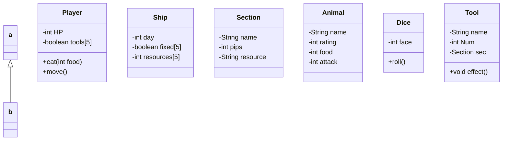

```mermaid
classDiagram
a <|-- b

class Player{
    -int HP
    -boolean tools[5]

    +eat(int food)
    +move()
}

class Ship{
    -int day
    -boolean fixed[5]
    -int resources[5]
}

class Section{
    -String name
    -int pips
    -String resource
}

class Animal{
    -String name
    -int rating
    -int food
    -int attack
}

class Dice{
    -int face

    +roll()
}

class Tool{
    -String name
    -int Num
    -Section sec

    +void effect()
}
```