# Class Diagram
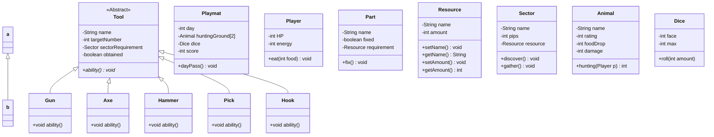

# Game Flow

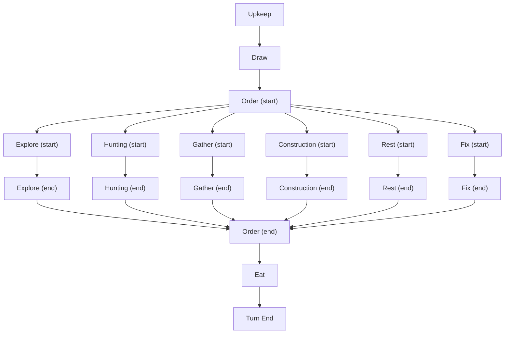

## Upkeep

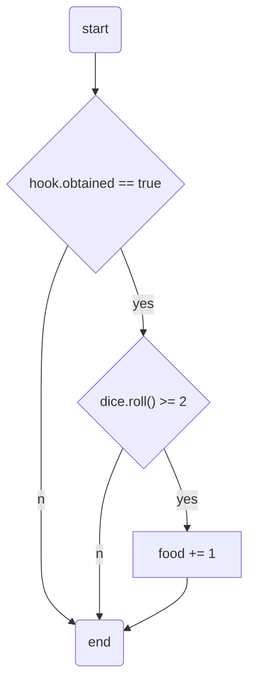

## Draw

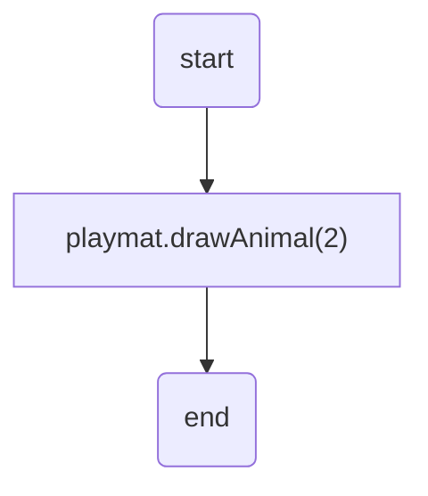

## Order

### Explore

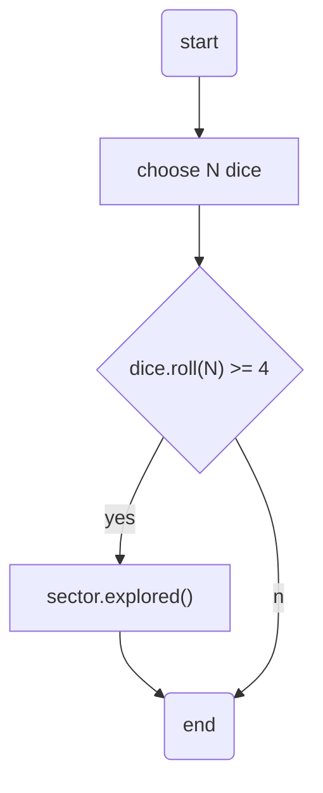

### Hunting

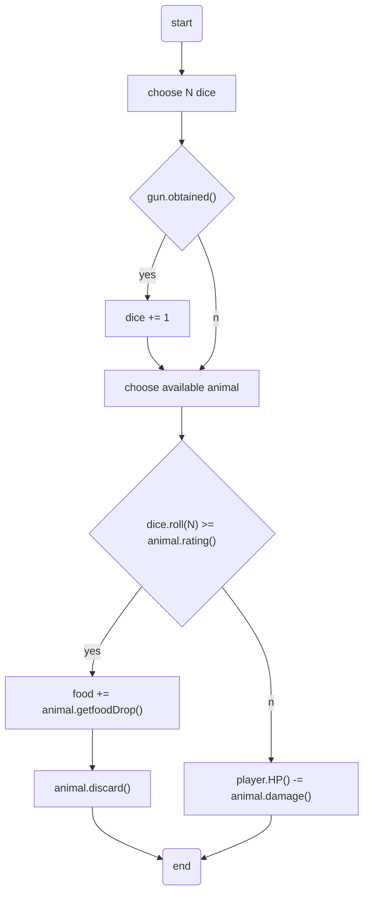

### Gather

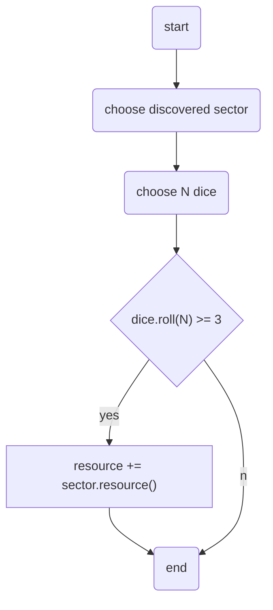

### Construction

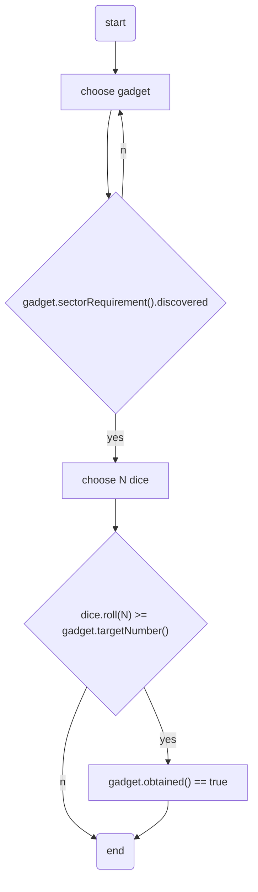

### Rest

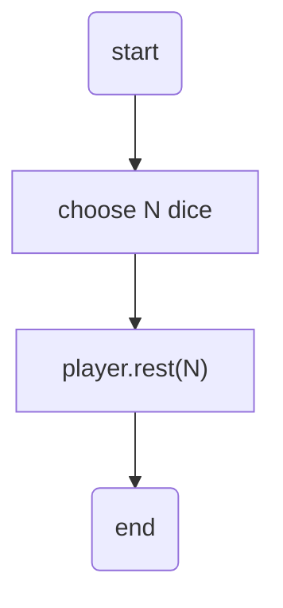

### Fix

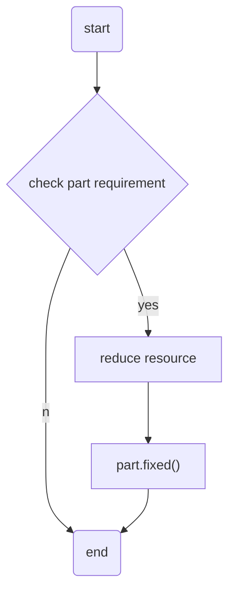

## Eat

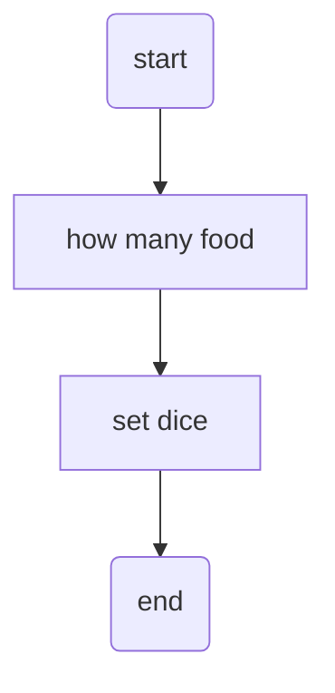

## Turn End

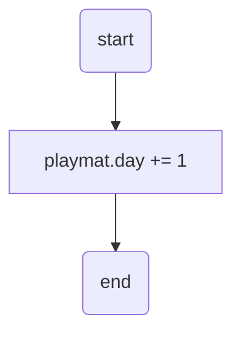

# Screen

## Ship

- Resources
- Gadgets
- Fixing
- Rest

## Sector

- Explore
- Gather

## Hunting Ground

- Hunting

